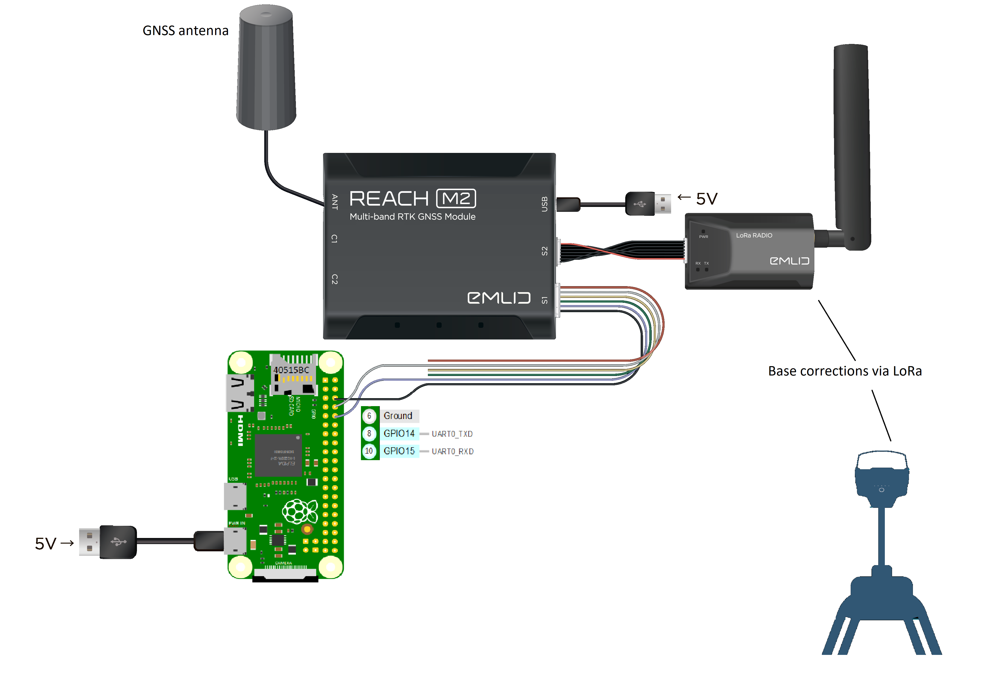

# gpslogger
This is a python3 GNSS logger code for polling NMEA sentences on a Raspberry Pi Zero running Raspian Buster OS.
It requires a GNSS module attached to the ttyS0 or serial0 port.

Code has been tested on ublox NEO-6M and M8N GNSS modules. The following diagram is the set up for connecting an Emlid Reach M2 GNSS receiver:

For it to work:
 - make sure all relevant libraries/packages are installed
 - place this script in /home/pi
 - create a folder in /home/pi called data

The script requires the gpsd service daemon installed on the RPiz
https://gpsd.gitlab.io/gpsd/index.html

Useful instructions for installing GPSD are here: https://ozzmaker.com/berrygps-setup-guide-raspberry-pi/

Also required is the gpsd-py3 package as an interface to gpsd - https://github.com/MartijnBraam/gpsd-py3
 -- pip3 install gpsd-py3
 
Once GNSS quality is greater than 2D, polling occurs.
Terminal output is time, latitude, longitude, mode and number of satellites
The saved output is a comma separated text file in the data folder named "GNSSlog_%Y%m%d--%H%M%S-%Z.txt", where Y is year, m is month, d is day, H is hour, M is minute, S is second and Z refers to zulu or UTC time.
Columns in the file are time, latitude and longitude

Further objects that can be polled are listed here:
https://github.com/MartijnBraam/gpsd-py3/blob/master/DOCS.md

Refer to Emlid documentation (https://emlid.com/au/docs/) for receiving RTK corrections on the M2.
